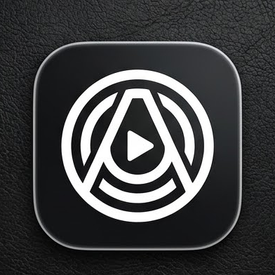
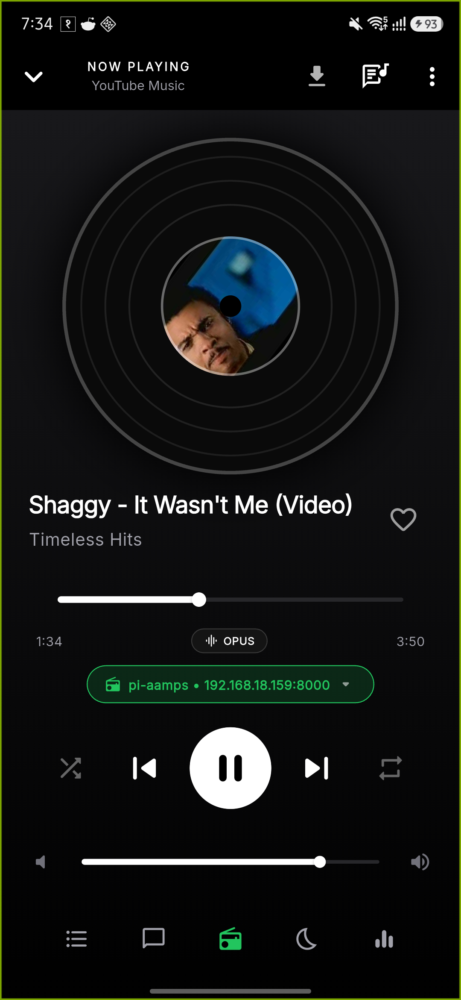
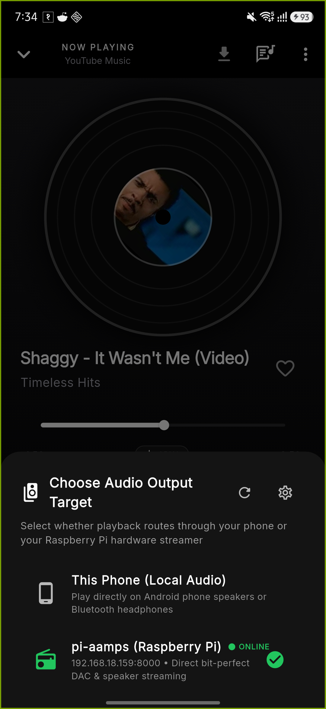
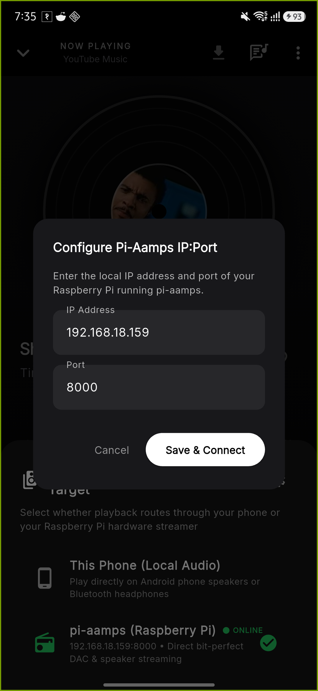
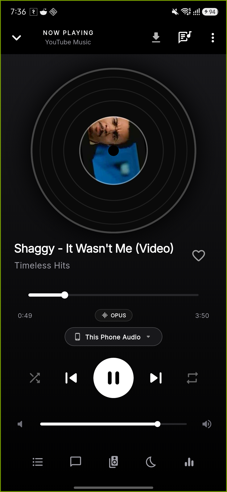
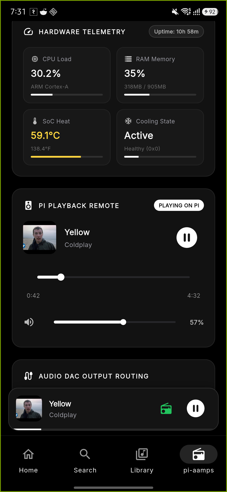
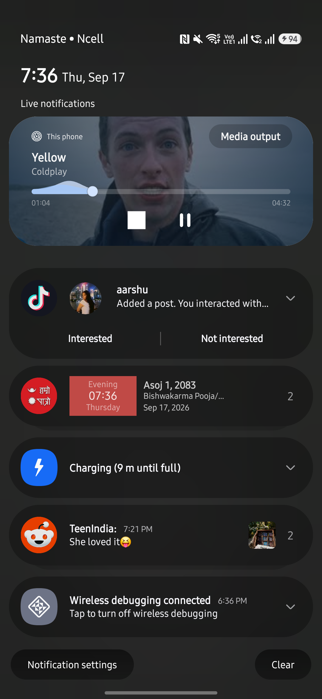
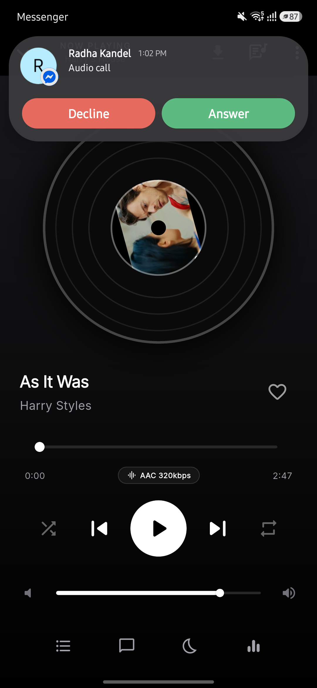

# pi-aamps & OpenAamps

<p align="center">
  
</p>

<h3 align="center">Audiophile Raspberry Pi Hi-Fi Hub &amp; Native Android Music Player</h3>

<p align="center">
  <em>Bit-perfect ALSA DAC hardware streaming, real-time synced lyrics, 10-band DSP, dual-target output routing, and zero advertisements.</em>
</p>

<p align="center">
  <a href="https://github.com/SharadS28N/raspberry-pi-music-player/releases/tag/v1.0.0">
    
  </a>
  <a href="releases/OpenAamps-v1.0.0.apk">
    
  </a>
  <a href="https://sharads28n.github.io/raspberry-pi-music-player/">
    
  </a>
  <a href="LICENSE">
    
  </a>
</p>

---

## Visual Showcase & Live Screenshots

All screenshots below were captured during real-world verification on a physical **Samsung Galaxy A16 (`SM-A166P`)** and **Raspberry Pi 4 Streamer** (`192.168.18.159:8000`).

### Mobile Android App (OpenAamps)

| Audiophile DAC Player (Pi Streaming) | Dual Output Target Routing | Network IP:Port Discovery |
| :---: | :---: | :---: |
|  |  |  |
| *Streaming Shaggy to Pi with moving timeline and OPUS/AAC badge.* | *1-tap toggle between Phone Audio and Pi DAC.* | *Custom IP and port configuration with connection test.* |

| Local Phone Playback Mode | Multi-Format Music Search | Android Media Notification |
| :---: | :---: | :---: |
|  |  |  |
| *Native ExoPlayer playback on phone speakers / headphones.* | *Instant query matching with 1-tap playback & queueing.* | *System lockscreen & notification drawer media session.* |

### Desktop Web Player (pi-aamps)

<p align="center">
  
  <br>
  <em>Spotify-style desktop web player served directly by the Raspberry Pi at <code>http://&lt;pi-ip&gt;:8000</code> with real-time hardware telemetry.</em>
</p>

---

## Key Highlights

- **Lossless Bit-Perfect DAC Streaming**: Bypasses Android and Linux software mixers. Direct ALSA hardware routing to I2S DAC HATs (HiFiBerry, Allo Boss, PCM5102), USB DACs, and 3.5mm analog audio up to 32-bit / 192kHz.
- **YouTube 403 Rate-Bypass Engine**: Automatically selects ratebypass-enabled muxed audio formats (`itag 18`) with `LocalStreamProxy` fallback, completely eliminating buffer stalls and Google Video 403 Forbidden errors.
- **Dual Output Target Switcher**: Toggle audio output on the fly between your **Raspberry Pi DAC Streamer** (`pi-aamps`) and **This Phone (Local Audio)** without interrupting your queue.
- **Configurable Network IP:Port**: Easily discover and configure the Raspberry Pi's local network address (`192.168.18.159:8000`) directly within the app interface.
- **Synchronized LRC Lyrics Engine**: Karaoke-style real-time scrolling lyrics with interactive line-seeking powered by LRCLIB.
- **10-Band Graphic Equalizer & DSP**: Full parametric equalizer with acoustic bass boost, virtualizer, and audiophile presets.
- **True AMOLED Black Aesthetic**: High-contrast true black (`#000000`) theme designed to conserve battery on OLED screens and eliminate eye strain.
- **System Media Session Integration**: Full playback controls (Play, Pause, Seek, Skip, Previous) directly from the Android lockscreen, status bar drawer, and Bluetooth car stereos.
- **Bluetooth A2DP Sink Mode**: Transform your Raspberry Pi into a high-fidelity Bluetooth receiver with a hardware radio power toggle.
- **Offline Song Caching**: Download songs and playlists locally to your Android device or Pi storage for offline playback.
- **Zero Ads & Zero Telemetry**: 100% free and open-source under the MIT license.

---

## System Architecture

```
+-----------------------------------------------------------------------------------+
|                           OPENAAMPS ANDROID FRONTEND                              |
|   Flutter + Dart | ExoPlayer | LocalStreamProxy (403 Ratebypass) | MediaSession   |
+-----------------------------------------------------------------------------------+
                                         |
                                         | REST API + WebSocket State Sync
                                         v
+-----------------------------------------------------------------------------------+
|                             PI-AAMPS BACKEND HUB                                  |
|   FastAPI + Python | MPV Playback Engine | yt-dlp Cache | SQLite Metadata         |
+-----------------------------------------------------------------------------------+
                                         |
                                         | Direct Hardware Control
                                         v
+-----------------------------------------------------------------------------------+
|                                AUDIO HARDWARE                                     |
|   ALSA Bit-Perfect Driver | I2S DACs / USB Audio / 3.5mm / BlueZ A2DP Sink        |
+-----------------------------------------------------------------------------------+
```

---

## Quick Start Installation

### 1. Raspberry Pi Server Setup (pi-aamps)

Run the official one-line installation script on your Raspberry Pi (Raspberry Pi OS Bookworm or Bullseye):

```bash
curl -sSL https://raw.githubusercontent.com/SharadS28N/raspberry-pi-music-player/main/install.sh | bash
```

The script automatically installs MPV, yt-dlp, Python dependencies, configures ALSA audio output, and registers `pi-aamps.service` as a background systemd daemon.

To manage the background service:
```bash
sudo systemctl status pi-aamps
sudo systemctl restart pi-aamps
```

Access the desktop web player in your browser at `http://<your-pi-ip>:8000`.

### 2. Android App Installation (OpenAamps)

1. Download the release APK directly to your phone:
   - **Download Link**: [OpenAamps-v1.0.0.apk](releases/OpenAamps-v1.0.0.apk)
   - Or from GitHub Releases: [Releases / v1.0.0](https://github.com/SharadS28N/raspberry-pi-music-player/releases/tag/v1.0.0)
2. Tap the downloaded file and select **Install** (allow installation from unknown sources if prompted).
3. Open **OpenAamps**. Tap the audio pill in the player or settings to verify the connection to your Raspberry Pi.

---

## Building from Source

### Building OpenAamps Android APK
```bash
cd mobile
flutter pub get
flutter build apk --release
```
The compiled binary will be generated at:
`mobile/build/app/outputs/flutter-apk/app-release.apk`

### Building Debian Package (`.deb`)
```bash
sudo bash build_deb.sh
```

---

## Project Structure

```
raspberry-pi-music-player/
├── backend/                  # FastAPI backend, MPV controller, yt-dlp engine
├── database/                 # SQLite schema, playlist, and track models
├── docs/                     # Public showcase website & architectural documentation
│   ├── assets/               # Production screenshots & branding
│   └── index.html            # GitHub Pages public landing page
├── frontend/                 # Pi local web interface & download showcase
│   ├── assets/               # Web player icons & screenshots
│   ├── download.html         # Local APK download & release notes page
│   └── index.html            # Spotify-style web player
├── mobile/                   # OpenAamps Flutter Android application
│   ├── android/              # Native Android gradle configuration & drawables
│   └── lib/                  # Dart UI views, services, models, & proxy
├── releases/                 # Production compiled APK binaries
│   └── OpenAamps-v1.0.0.apk  # Verified 62 MB standalone release APK
├── install.sh                # Single-line automated Raspberry Pi installer
└── run.py                    # Local development launcher
```

---

## Technical Documentation

Detailed architectural and developer guides are available in the [`docs/`](docs/) directory:

| Document | Description |
| :--- | :--- |
| [00. Overview & Ecosystem](docs/00-overview.md) | High-level philosophy, hardware streamer design, and dual-mode architecture. |
| [01. System Architecture](docs/01-system-architecture.md) | End-to-end data pipeline, threading model, and WebSocket synchronization. |
| [02. Raspberry Pi & Hardware DACs](docs/02-raspberry-pi.md) | I2S HATs (HiFiBerry, Allo Boss, PCM5102), USB DACs, and ALSA configuration. |
| [03. Backend Engine (FastAPI & MPV)](docs/03-backend.md) | Asynchronous backend API, SQLite data store, and telemetry publisher. |
| [04. Frontend & Web Player](docs/04-frontend.md) | Spotify-style web player interface and OpenAamps Android client design. |
| [05. MPV Integration & IPC](docs/05-mpv-integration.md) | Low-latency JSON IPC control, hardware volume scaling, and gapless playback. |
| [06. yt-dlp Caching & YouTube Bypass](docs/06-ytdlp-integration.md) | Stream resolution, metadata caching, and 403 rate-bypass implementation. |
| [07. REST API Reference](docs/07-api.md) | Request and response specifications for `/api/play`, `/api/status`, and control endpoints. |
| [08. WebSocket Real-Time Events](docs/08-websocket.md) | Real-time bi-directional messaging for playback position, queue, and telemetry. |
| [09-14. Reference & Troubleshooting](docs/09-14-project-reference.md) | Production systemd setup, BlueZ Bluetooth pairing, and ALSA diagnostics. |

---

## License

This project is licensed under the **MIT License** - see the [LICENSE](LICENSE) file for details.
