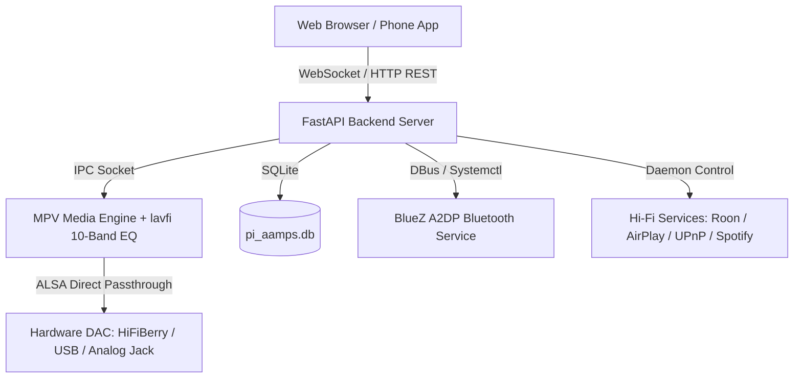

# 🎵 pi-aamps — Pi Advanced Audio & Music Player System

<p align="center">
  
  
  
  
</p>

---

## 🌟 Overview

**pi-aamps** (Pi Advanced Audio & Music Player System) is a state-of-the-art, zero-glitch Web Operating System dedicated to high-fidelity audio playback on Raspberry Pi devices. Inspired by CasaOS and premium Hi-Fi streaming hardware, **pi-aamps** delivers ultra-low RAM (<50MB) and CPU usage while converting your Raspberry Pi into a full-fledged music engine.

Whether connected to a high-end USB DAC, an audiophile HAT DAC (HiFiBerry, Allo Boss, IQaudio), or standard 3.5mm/HDMI outputs, **pi-aamps** acts as a unified hub supporting **Roon Endpoint**, **AirPlay Receiver**, **UPnP/DLNA Renderer**, **Spotify Connect**, and **YouTube Streaming**.

---

## 🖥️ Web OS Interface Snapshot

```
+-------------------------------------------------------------------------------------------------------------------------+
|  🎵 pi-aamps v2.5 OS | pi-aamps.local  |  [CPU 12%] [RAM 180MB] [42°C] [DAC: HiFiBerry DAC+] [BT Receiver: On]   [Hi-Fi Hub] |
+-------------------------------------------------------------------------------------------------------------------------+
|                                                                                                                         |
|   +----------------------------------------------------+   +----------------------------------------------------+       |
|   | 🎵 NOW PLAYING (Spotify / Apple Music Deck)        |   | 🔍 SEARCH & QUEUE ENGINE                           |       |
|   | +------------------------------------------------+ |   | [ Search songs, artists, albums...        [Search] ]|       |
|   | |                                                | |   |                                                    |       |
|   | |             [ HIGH-RES ALBUM ART ]             | |   | Playing Queue (4 tracks)               Clear Queue |       |
|   | |                                                | |   | 1. Bohemian Rhapsody — Queen                      |       |
|   | +------------------------------------------------+ |   | 2. Hotel California — Eagles                      |       |
|   |                                                    |   | 3. Starboy — The Weeknd                            |       |
|   | Starboy — The Weeknd ft. Daft Punk                 |   | 4. Blinding Lights — The Weeknd                    |       |
|   | 02:45 [======================-------] 03:50        |   |                                                    |       |
|   |      [Shuffle] [⏮]  [ ⏸ ]  [⏭] [Repeat]          |   | +------------------------------------------------+ |       |
|   | Volume: [==============------] 85%                |   | | 🎛️ 10-Band Parametric Equalizer                 | |       |
|   +----------------------------------------------------+   | | [31Hz] [62Hz] [125Hz] [250Hz] [500Hz] [1k]...   | |       |
|                                                            | +------------------------------------------------+ |       |
|   +----------------------------------------------------+   +----------------------------------------------------+       |
|   | 📡 HI-FI STREAMING DAEMONS                         |                                                            |
|   | [Roon Endpoint: ON]     [AirPlay Receiver: ON]     |   +----------------------------------------------------+       |
|   | [UPnP/DLNA: ON]         [Spotify Connect: ON]      |   | ⚙️ SYSTEM CUSTOMIZATION & HARDWARE DAC SELECTOR    |       |
|   +----------------------------------------------------+   +----------------------------------------------------+       |
|                                                                                                                         |
+-------------------------------------------------------------------------------------------------------------------------+
```

---

## 🔥 Key Features

- **CasaOS-Style Web OS Interface**: Glassmorphic top bar with live telemetry (CPU %, RAM MB, Storage, Temp °C, Active DAC badge, Bluetooth status).
- **Roon Endpoint Integration**: Minimal, stable audio bridge designed for USB & HAT DACs.
- **AirPlay Receiver (Shairport-Sync)**: Lossless streaming receiver from Apple iOS & macOS devices.
- **UPnP / DLNA Renderer**: Seamless DLNA media target for BubbleUPnP, mconnect, and Audirvana.
- **Spotify Connect (Librespot)**: Hardware playback sink directly controllable from Spotify apps.
- **10-Band Parametric/Graphic Equalizer**: Sliders from `31Hz` to `16kHz` powered by MPV `lavfi` audio filters with 9 presets (Bass Boost, Vocal, Treble, Party, Rock, Jazz, Electronic, Acoustic).
- **HAT DAC & Hardware Audio Switcher**: Instant detection and auto-configuration for HiFiBerry DAC+, Allo Boss, IQaudio DAC+, USB DACs, 3.5mm Analog Jack, and HDMI.
- **Full Customization**:
  - Customize Bluetooth Advertising Device Name (`set_device_name`).
  - Customize Raspberry Pi Hostname (`set_system_hostname`).
  - Clear and Reset Database with 1-click modal.
- **Endless Autoplay & Real-Time Syncing**: WebSocket real-time broadcast across all connected browsers.

---

## ⚡ Installation (Standard Debian / APT Pattern)

### Method 1: Installing via APT / Debian Package (Recommended)

Download or build the `.deb` package and install using standard Linux package manager:

```bash
# Build the package (or download pi-aamps_2.5.0_all.deb)
sudo bash build_deb.sh

# Install using apt / dpkg
sudo apt install ./pi-aamps_2.5.0_all.deb
```

### Method 2: One-Line Installer Script

Run the automated 1-line installation script on your Raspberry Pi:

```bash
curl -sSL https://raw.githubusercontent.com/SharadS28N/raspberry-pi-music-player/main/install.sh | sudo bash
```

---

## 🏗️ System Architecture



---

## 🧪 Running Unit & System Tests

**pi-aamps** includes a 100% pass test suite verifying all REST API endpoints, equalizer processing, system metrics, and database resets:

```bash
python -m pytest
```

---

## 📜 License

This project is open-source under the [MIT License](LICENSE).
